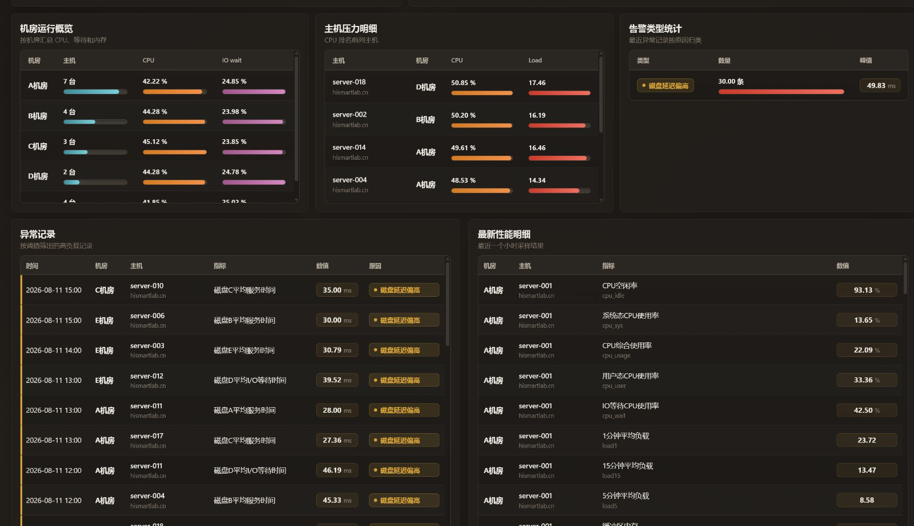
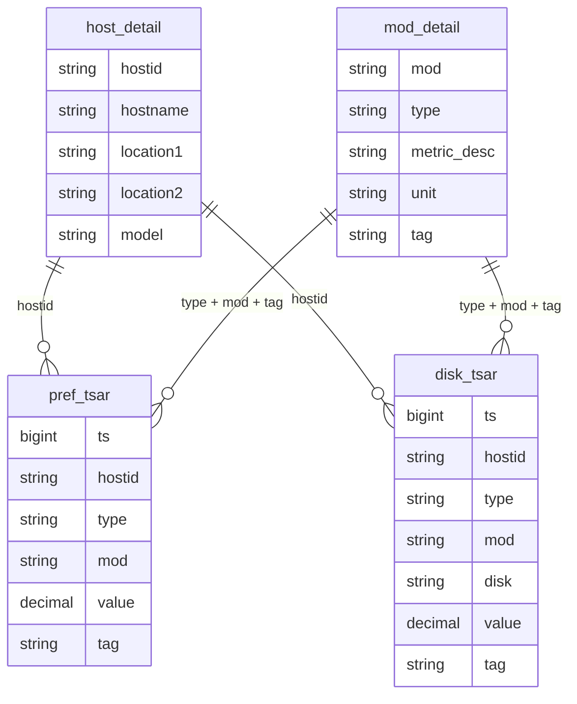

# 数据中心运行监控大屏

这是“大数据专题作业2”的实现代码。项目把老师给的四张 `.dat` 明细数据导入 MySQL，按小时加工成汇总表，再用 Node.js + ECharts 做成 PC 端数据中心运行监控大屏。

## 效果预览

大屏顶部展示主机数量、指标数量、异常记录和最新采样时间，中间是性能趋势、磁盘趋势、机房对比和主机排行。


下方补充了机房运行概览、主机压力明细、告警类型统计、异常记录和最新性能明细，方便从图表继续追到具体主机和指标。



## 已实现内容

- 数据导入：读取 `disk_tsar.dat`、`pref_tsar.dat`、`host_detail.dat`、`mod_detail.dat`，写入 MySQL。
- 时间处理：把 Unix 毫秒时间戳转换为北京时间，并提取日期、小时。
- 小时汇总：生成 `pref_hourly_summary`、`disk_hourly_summary`，包含均值、最大值、最小值和采样数。
- 关系关联：监控明细通过 `hostid` 关联主机信息，通过 `type + mod + tag` 关联指标说明。
- 可视化大屏：完成 PC 端监控大屏，包括趋势图、排行图、对比图、异常表格和最新明细。
- 交互筛选：支持按机房筛选，筛选后 KPI、图表和表格同步刷新。
- 告警识别：按 CPU、内存、磁盘延迟等阈值筛出异常记录。

## 技术栈

| 类型 | 使用内容 |
| --- | --- |
| 后端 | Node.js、Express |
| 数据库 | MySQL 8 |
| 数据导入 | mysql2、Node.js 文件流处理 |
| 可视化 | ECharts |
| 前端 | 原生 HTML / CSS / JavaScript |
| 本地环境 | Docker Compose 可选 |

## 项目结构

```text
DatacenterMonitor
├── README.md
├── package.json
├── docker-compose.yml
├── .env.example
├── disk_tsar.dat
├── pref_tsar.dat
├── host_detail.dat
├── mod_detail.dat
├── docs/
│   └── images/
│       ├── dashboard-overview.png
│       └── dashboard-tables.png
├── public/
│   ├── index.html
│   ├── app.js
│   └── styles.css
├── scripts/
│   └── import-data.js
├── sql/
│   └── example_queries.sql
└── src/
    ├── db.js
    └── server.js
```

## 四张数据表的关系



关系理解：

- `host_detail` 是主机维度表，存主机编号、主机名、机房位置等信息。
- `mod_detail` 是指标字典表，解释每个指标代码对应的中文含义和单位。
- `pref_tsar` 是性能监控明细，主要包括 CPU、内存、网络、进程、负载等指标。
- `disk_tsar` 是磁盘监控明细，主要包括磁盘利用率、磁盘延迟、读写扇区等指标。
- 两张明细表都可以通过 `hostid` 找到主机，通过 `type + mod + tag` 找到指标说明。

## 数据处理流程

```text
原始 .dat 文件
   ↓
scripts/import-data.js 创建基础表
   ↓
批量导入 host_detail / mod_detail / pref_tsar / disk_tsar
   ↓
把 ts 毫秒时间戳转换成北京时间 event_time / event_hour
   ↓
按 hostid + 指标 + 小时 聚合
   ↓
生成 pref_hourly_summary / disk_hourly_summary
   ↓
Express API 查询汇总数据
   ↓
ECharts + 表格渲染大屏
```

时间戳转换核心逻辑：

```sql
TIMESTAMPADD(SECOND, FLOOR(ts / 1000) + 28800, '1970-01-01 00:00:00')
```

这里 `ts` 是毫秒时间戳，先除以 `1000` 变成秒，再加 `28800` 秒转换为北京时间。

小时汇总字段：

| 字段 | 含义 |
| --- | --- |
| `event_hour` | 按小时截断后的时间 |
| `avg_value` | 该小时平均值 |
| `max_value` | 该小时最大值 |
| `min_value` | 该小时最小值 |
| `sample_cnt` | 该小时采样数量 |

## 页面功能

| 模块 | 说明 |
| --- | --- |
| 顶部 KPI | 主机数量、指标数量、CPU 均值、内存均值、磁盘利用率、异常记录数 |
| 性能指标小时趋势 | CPU 使用率、CPU 等待、内存、网络入站按小时展示 |
| 主机 CPU 排行 | 最近 24 小时 CPU 使用率较高的主机 |
| 机房资源对比 | 按机房对比 CPU、IO wait、主机数 |
| 磁盘指标小时趋势 | 磁盘延迟、磁盘利用率、读写扇区 |
| 机房运行概览 | 每个机房的主机数量、CPU、IO wait 条形展示 |
| 主机压力明细 | 高 CPU / 高负载主机列表 |
| 告警类型统计 | 按异常原因汇总数量和峰值 |
| 异常记录 | 展示超过阈值的具体主机、时间、指标和原因 |
| 最新性能明细 | 最近一个小时的主机性能指标明细 |

## 接口说明

| 接口 | 用途 |
| --- | --- |
| `GET /api/health` | 检查服务和数据库连接 |
| `GET /api/options` | 获取机房下拉筛选项 |
| `GET /api/overview?room=all` | 顶部 KPI 概览 |
| `GET /api/trends?hours=240&room=all` | 性能指标小时趋势 |
| `GET /api/disk-trends?hours=240&room=all` | 磁盘指标小时趋势 |
| `GET /api/rooms` | 机房资源汇总 |
| `GET /api/top-hosts?limit=10&room=all` | 主机 CPU 排行 |
| `GET /api/alerts?limit=30&room=all` | 异常记录 |
| `GET /api/latest-metrics?limit=80&room=all` | 最新性能明细 |

## 快速运行

### 1. 安装依赖

```bash
npm install
```

### 2. 准备数据库

如果本机没有 MySQL，可以先启动 Docker Desktop，然后执行：

```bash
npm run db:up
```

这个命令会启动 `docker-compose.yml` 里的 MySQL 容器。

如果本机已经安装 MySQL，也可以复制 `.env.example` 为 `.env`，按自己的数据库账号修改：

```bash
DB_HOST=localhost
DB_PORT=3306
DB_USER=root
DB_PASSWORD=123456
DB_NAME=datacenter_monitor
```

### 3. 导入数据

```bash
npm run db:import
```

导入脚本会自动完成：

- 创建基础表
- 导入四张 `.dat`
- 生成小时汇总表
- 创建常用索引
- 输出行数校验结果

导入后基础数据行数应为：

| 表名 | 行数 |
| --- | ---: |
| `host_detail` | 20 |
| `mod_detail` | 55 |
| `disk_tsar` | 12000 |
| `pref_tsar` | 67200 |

### 4. 启动大屏

```bash
npm run dev
```

浏览器打开：

```text
http://localhost:3000
```

## 常用 SQL

项目里放了参考 SQL：

```text
sql/example_queries.sql
```

里面包括：

- 导入行数校验
- 时间戳解析示例
- `pref_tsar` 小时汇总查询
- 单主机 CPU 使用率小时走势
- 关联主机和指标字典后的可读结果

## 提交说明

当前仓库地址：

```text
https://github.com/YxY09/DatacenterMonitor
```

本地修改后提交：

```bash
git add .
git commit -m "更新说明文档"
git push
```

## 说明

这个项目主要围绕老师要求的三件事来做：数据加工入库、按小时汇总指标、开发可视化大屏。界面优先保证 PC 端展示效果，移动端可以打开，但不是主要适配对象。
